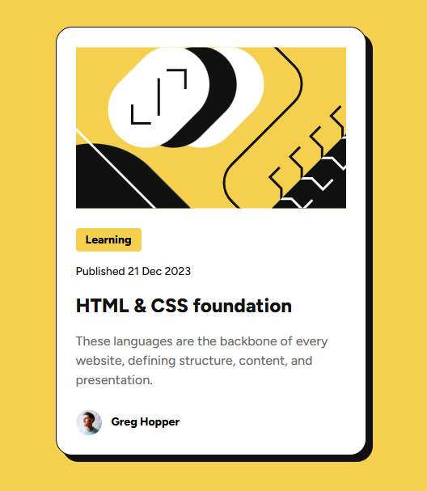

# Frontend Mentor - Blog preview card solution

This is a solution to the [Blog preview card challenge on Frontend Mentor](https://www.frontendmentor.io/challenges/blog-preview-card-ckPaj01IcS).

## Table of contents

- [Screenshot](#screenshot)
- [Links](#links)
- [Built with](#built-with)
- [What I learned](#what-i-learned)
- [Author](#author)

## Screenshot

## Links

- Solution URL: [Add solution URL here](https://your-solution-url.com)
- Live Site URL: [Add live site URL here](https://your-live-site-url.com)

## Built with

- Semantic HTML5 markup
- CSS custom properties
- Flexbox
- Desktop-first workflow

## What I learned

Practiced using `clamp()` for fluid sizing without media queries, and reinforced the use of CSS custom properties for a consistent design token system. Also consolidated the pattern of text preset utility classes for typography.

## AI Collaboration

I used Claude (Anthropic) as a learning companion — not to generate code, but to ask targeted questions while building independently. Claude helped clarify concepts like `clamp()`, `position: fixed` vs `absolute`, and CSS variable structure, always letting me write the code myself.

## Author

- Frontend Mentor - [@yourusername](https://www.frontendmentor.io/profile/yourusername)
